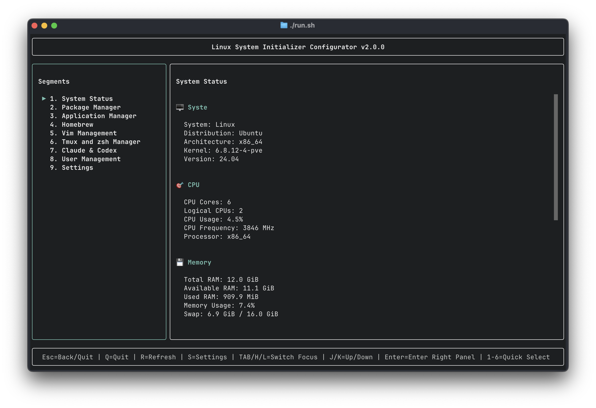
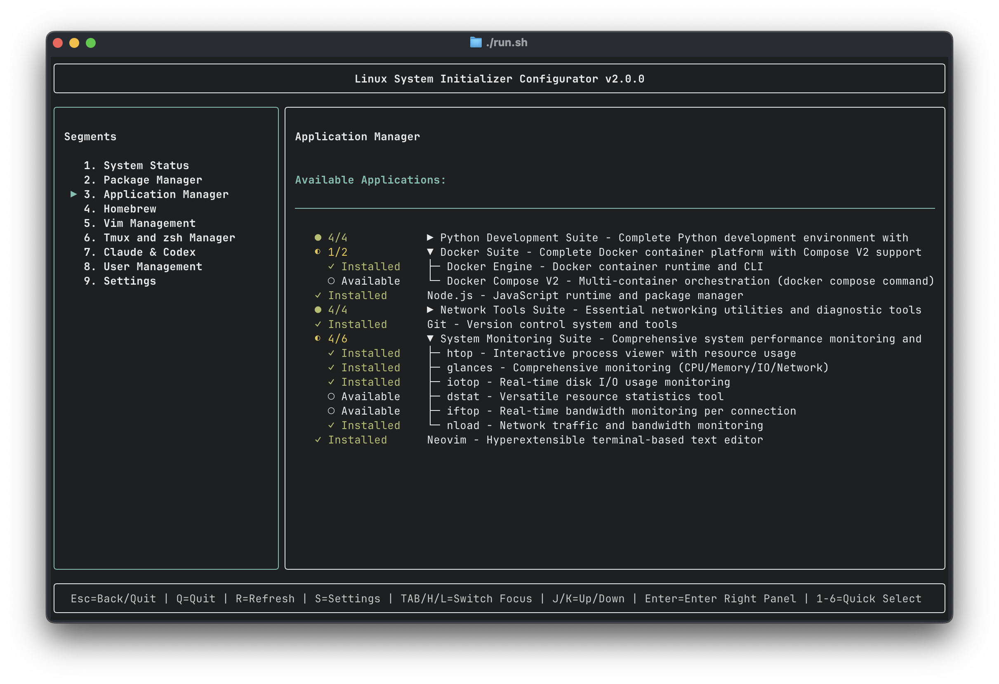
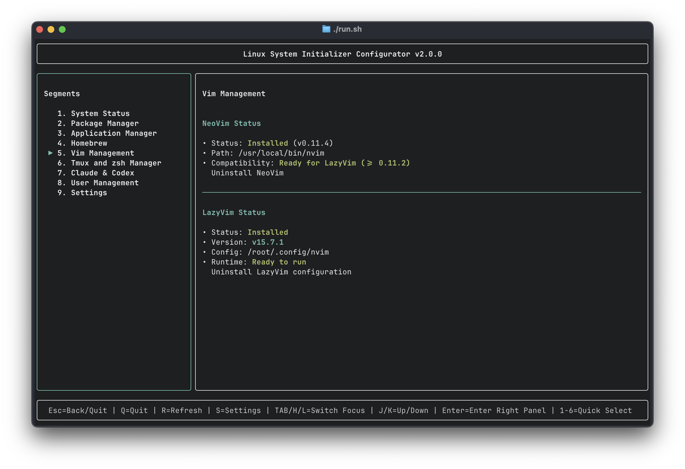
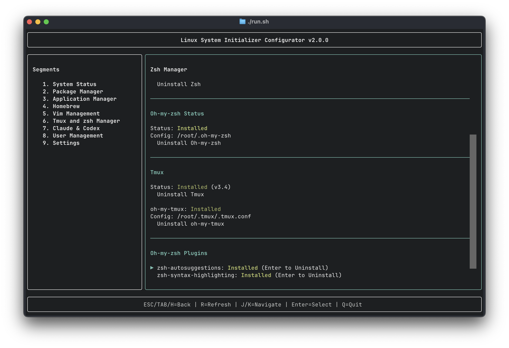

# Linux System Initializer

A modern, production-grade Terminal User Interface (TUI) application for comprehensive Linux system initialization and configuration. Built with Python Rich/Textual framework, featuring 9 fully implemented modules with 23,000+ lines of code.

## 🌟 Features

- **Modern TUI Interface**: Built with Python Rich/Textual for beautiful, responsive terminal interfaces
- **Keyboard-First Operation**: Complete keyboard navigation with hjkl/arrow keys, Tab focus switching, and number shortcuts
- **9 Complete Modules**: System info, package management, application installer, Homebrew, Vim, Zsh/Tmux, Claude/Codex, user management, and settings
- **Configuration-Driven**: YAML-based configuration system with modular settings
- **Async Operations**: Non-blocking UI with async task management and progress tracking
- **Rich Modal System**: 19+ modal dialogs for confirmations, progress, and user interactions
- **Cross-Platform**: Works on various Linux distributions with auto-detection
- **Headless Server Support**: Optimized for SSH and headless environments
- **Theme System**: 3 built-in themes (default, dark, light)
- **Comprehensive Logging**: Module-level and file-level logging configuration
- **Auto Terminal Cleanup**: Prevents terminal state issues after abnormal exits

## 🚀 Quick Start

### Prerequisites

- Python 3.8 or higher
- Linux operating system (Ubuntu/Debian/Arch/Fedora/etc.)
- Terminal with 256 color support

### Installation

1. **Clone the repository:**

```bash
git clone https://github.com/DeltaV235/Initializer.git
cd Initializer
```

2. **Run the setup script:**

```bash
./install.sh

# Install with development dependencies
./install.sh --dev

# Auto-confirm mode (non-interactive)
./install.sh --auto-confirm
```

3. **Launch the application:**

```bash
./run.sh
```

**Or manually:**

```bash
source .venv/bin/activate
python main.py
```

### Command Line Options

```bash
python main.py --help

Options:
  -c, --config-dir TEXT   Configuration directory path
  --headless              Run in headless mode (no animations)
  --debug                 Enable debug mode with verbose logging
  --help                  Show this message and exit
```

## ⌨️ Keyboard Navigation

The application is designed for **keyboard-first operation**:

### Global Shortcuts
- **q**: Quit application
- **Tab**: Switch focus between panels
- **h/l**: Navigate to left/right panel (Vim-style)
- **j/k**: Move up/down within focused panel
- **Enter**: Select/activate current item
- **1-9**: Quick jump to segment by number
- **s**: Jump to Settings

### Visual Feedback
- **Blue Border**: Indicates active panel with focus
- **Arrow (▶)**: Shows currently selected segment
- **Help Box**: Bottom area displays available shortcuts

## 🔗 Remote Sync and Execution

For non-WSL/macOS/Windows environments, sync and execute on remote Linux server:

```bash
# Sync to default remote (root@192.168.0.33:~/Initializer)
tools/sync-to-remote.sh

# Dry run to preview changes
tools/sync-to-remote.sh -n

# Custom host/user/destination
tools/sync-to-remote.sh -H 192.168.0.33 -u root -D ~/Initializer
```

Then on the remote server:

```bash
ssh root@192.168.0.33
cd ~/Initializer
./install.sh
./run.sh
```

**Note**: WSL users may test locally, but should verify on actual Linux environment.

## 📋 Modules

All 9 modules are **fully implemented and production-ready**:

### 1. System Status

- Real-time system information display
- Hardware details (CPU, memory, disk, network)
- Software information (OS, kernel, package managers)
- System resource monitoring

### 2. Package Manager

- Auto-detect available package managers (apt, yum, pacman, etc.)
- Configure mirror sources for faster downloads
- Update package manager configuration
- Support for multiple distributions

### 3. Application Manager

- Batch application installation
- Pre-configured application lists (apt/Homebrew)
- Installation progress tracking
- Dependency management
- Quick verification and two-layer checking

### 4. Homebrew Management

- Homebrew installation for Linux
- Mirror source configuration
- Essential package installation
- Version management

### 5. Vim Management

- NeoVim installation (minimum version 0.11.2)
- LazyVim configuration setup
- Plugin management
- Installation progress tracking

### 6. Tmux & ZSH Manager

- Zsh shell installation and configuration
- Oh-my-zsh framework setup
- Tmux installation and configuration
- Shell migration with config backup
- Custom prompt and theme setup

### 7. Claude & Codex Management

- Claude Code CLI installation
- Codex CLI installation
- Installation method detection (brew/manual)
- Uninstall information modal
- Version management

### 8. User Management

- User creation and configuration
- SSH key setup and management
- User permission management
- Sudo configuration

### 9. Settings

- Application preferences
- Theme switching (default/dark/light)
- Module enable/disable
- Configuration management

## ⚙️ Configuration

Configuration files are located in the `config/` directory:

### Main Configuration Files

- **`app.yaml`**: Main application settings, UI preferences, and behavior
- **`modules.yaml`**: Module-specific configuration for all 9 modules
- **`themes.yaml`**: UI themes (default, dark, light) and color schemes
- **`logging.yaml`**: Detailed logging configuration (module-level and file-level)
- **`applications_apt.yaml`**: APT package manager application lists
- **`applications_homebrew.yaml`**: Homebrew application lists

### Custom Configuration

You can modify the configuration files to customize the application behavior. Edit the YAML files in the `config/` directory and restart the application.

## 🎨 Themes

The application supports three built-in themes:

- **`default`**: Standard blue theme with high contrast
- **`dark`**: Dark mode theme for low-light environments
- **`light`**: Light theme for bright terminals

Switch themes in the Settings module or by editing `config/app.yaml`.

## 🖥️ Screenshots

### System Status

*Real-time system status monitoring and information display*

### Application Manager

*Application installation and management interface*

### Vim Management

*Vim configuration and plugin management*

### Tmux & ZSH Manager

*Terminal multiplexer and shell configuration interface*

## 🔧 Development

### Project Statistics

- **Total Python Code**: 23,777 lines
- **Source Files**: 62 Python files
- **UI Screens**: 39 screen/modal components
- **Modules**: 12 feature modules
- **Configuration Files**: 6 YAML configuration files
- **Development Tools**: 3 shell scripts

### Project Structure

```text
Initializer/
├── config/                    # Configuration files
│   ├── app.yaml              # Main app settings
│   ├── modules.yaml          # Module configurations
│   ├── themes.yaml           # UI themes
│   ├── logging.yaml          # Logging config
│   ├── applications_apt.yaml # APT packages
│   └── applications_homebrew.yaml # Homebrew packages
├── src/initializer/          # Main Python package
│   ├── app.py               # TUI application class
│   ├── config_manager.py    # Configuration management
│   ├── modules/             # 12 feature modules
│   │   ├── system_info.py
│   │   ├── package_manager.py
│   │   ├── app_installer.py
│   │   ├── vim_manager.py
│   │   ├── zsh_manager.py
│   │   ├── claude_codex_manager.py
│   │   ├── sudo_manager.py
│   │   └── ...
│   ├── ui/                  # UI components
│   │   ├── screens/         # 39 screen/modal files
│   │   │   ├── main_menu.py
│   │   │   ├── main_menu_components/ # 12 sub-components
│   │   │   ├── settings.py
│   │   │   ├── vim_management.py
│   │   │   ├── zsh_manager.py
│   │   │   └── modals/      # 19+ modal dialogs
│   │   └── styles.css       # Textual CSS styling
│   └── utils/               # Utility functions
├── tools/                   # Development tools
│   ├── sync-to-remote.sh   # Remote deployment
│   ├── reset-terminal.sh   # Terminal cleanup
│   └── check-test-environment.sh # Environment detection
├── legacy/                  # Original bash scripts (backup)
├── install.sh              # Installation script
├── run.sh                  # Run wrapper with cleanup
├── uninstall.sh           # Uninstall script
└── main.py                # Application entry point
```

### Technology Stack

**Core Dependencies:**
- **Rich** (>=13.0.0): Terminal formatting and rendering
- **Textual** (>=0.41.0): TUI framework
- **PyYAML** (>=6.0.0): Configuration file handling
- **Click** (>=8.0.0): Command-line interface
- **psutil** (>=5.9.0): System information gathering
- **distro** (>=1.8.0): Linux distribution detection

**Development Dependencies:**
- **pytest** (>=7.0.0): Testing framework
- **black** (>=22.0.0): Code formatter
- **flake8** (>=5.0.0): Linting
- **mypy** (>=1.0.0): Type checking

### Development Commands

```bash
# Code formatting
black src/

# Linting
flake8 src/

# Type checking
mypy src/

# Testing
pytest

# Run with debug logging
./run.sh --debug
```

### Adding New Modules

1. **Create module** in `src/initializer/modules/`
   ```python
   class MyModule:
       def __init__(self):
           pass

       def execute(self):
           # Implementation
           pass
   ```

2. **Add configuration** to `config/modules.yaml`
   ```yaml
   my_module:
     enabled: true
     settings:
       option1: value1
   ```

3. **Create UI screen** in `src/initializer/ui/screens/`
   ```python
   from textual.screen import Screen

   class MyModuleScreen(Screen):
       def compose(self):
           yield Header()
           yield MyContent()
           yield Footer()
   ```

4. **Register in main menu** (`src/initializer/ui/screens/main_menu.py`)
   ```python
   SEGMENTS = [
       # ... existing segments
       {"id": "my_module", "label": "My Module"},
   ]
   ```

### Architecture Patterns

- **Async Operations**: Use `@work` decorator for non-blocking tasks
- **Modal Dialogs**: Consistent size system with 8 CSS classes
- **Event Handling**: Textual's message-based event system
- **Reactive Attributes**: Automatic UI updates with `reactive()`
- **Configuration Management**: YAML-based with inheritance
- **Logging**: Structured logging with module-level control

## 🛠️ Tools and Scripts

### Installation Script (`install.sh`)

```bash
# Standard installation
./install.sh

# With development dependencies
./install.sh --dev

# Keep legacy scripts
./install.sh --legacy

# Auto-confirm all prompts
./install.sh --auto-confirm
```

### Run Script (`run.sh`)

Automatically handles:
- Virtual environment activation
- Python path setup
- Terminal state cleanup after exit

### Remote Sync (`tools/sync-to-remote.sh`)

Deploy to remote Linux server for testing:
- Supports custom host/user/destination
- Dry-run mode for safety
- Excludes unnecessary files (.git, .venv, __pycache__)

### Terminal Reset (`tools/reset-terminal.sh`)

Fixes terminal state issues:
- Exit alternate screen buffer
- Disable mouse tracking
- Show cursor
- Reset terminal attributes

## 📜 Legacy Scripts

The original bash scripts are preserved in the `legacy/` directory for reference:

```bash
cd legacy/01-linux-initial-scripts
./00-main.sh
```

These scripts provide the same functionality but without the modern TUI interface.

## 🐛 Troubleshooting

### Terminal Display Issues

If terminal displays incorrectly after abnormal exit:

```bash
./tools/reset-terminal.sh
```

### Permission Issues

Ensure scripts are executable:

```bash
chmod +x install.sh run.sh uninstall.sh
chmod +x tools/*.sh
```

### Virtual Environment Issues

Recreate virtual environment:

```bash
rm -rf .venv
./install.sh
```

